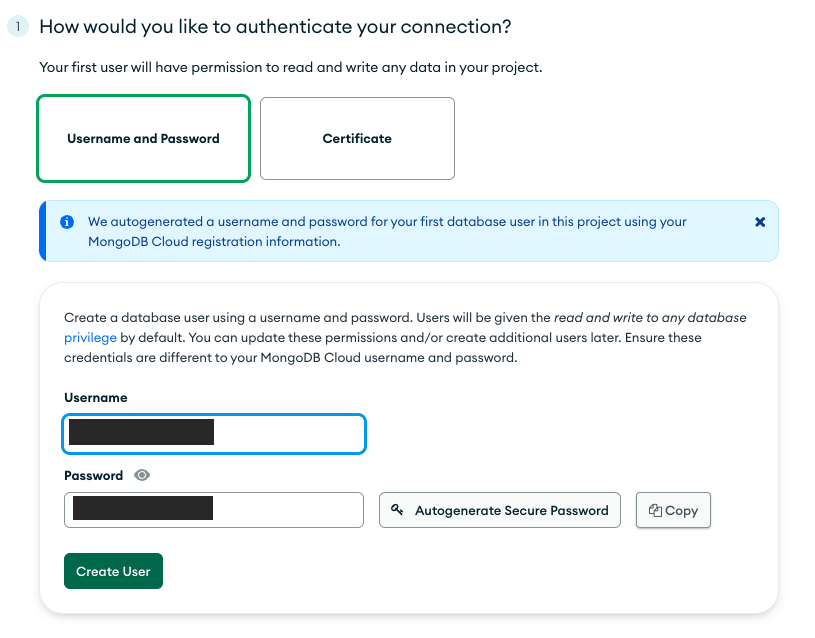
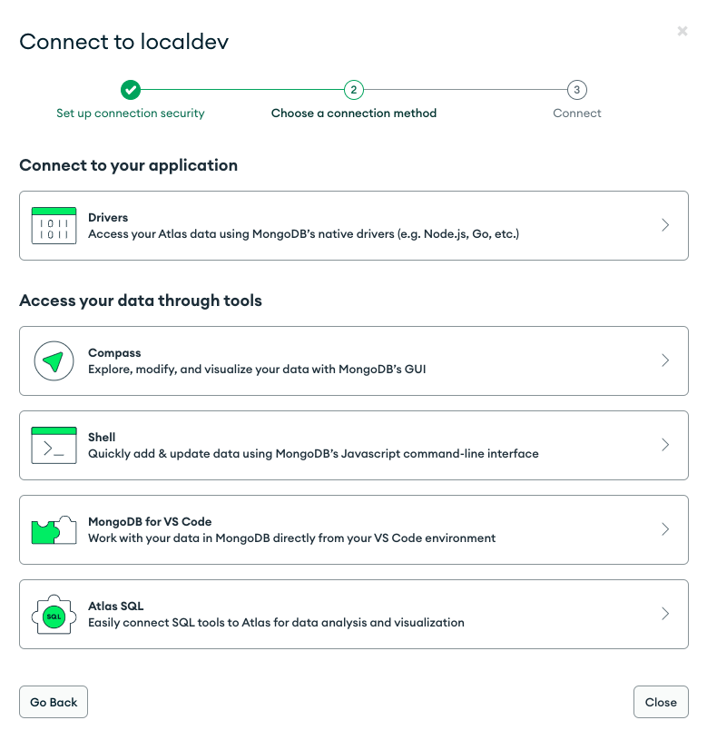
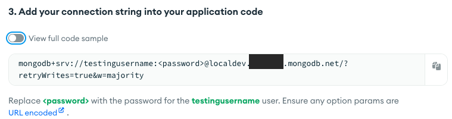

### Create MongoDB database

In this guide, you'll create a MongoDB database on MongoDB Atlas. For your information, you can also use any MongoDB provider.

First, you need to create a MongoDB Atlas account by following this link: https://www.mongodb.com/. After creating your account and successfully signed in, you'll need to create a new project. Then, you should be able to see the following screen:

You can click on the `Build a Database` button. In the next screen, you can select the cloud provider and region. Additionally, you can also choose the database name:

After clicking on the `Create` button, you'll be redirected to the following screen:

You'll need to create a new database user by adding a username and password.

> :warning: Please save the username and password. You'll need it later.

Then, you can click on the `Create User` button. After that, you need to whitelist `0.0.0.0/0` (Lambda don't have a static IP address) in the `Where would you like to connect from?` section:

After adding `0.0.0.0/0` to the IP access list, you can click on `Finish and Close`.

Then, you'll need to retrieve the connection string by clicking on the `Connect` button:

A new popup will appear and you can select the `Driver` button:

Finally, you can copy the connection string and save it for the next section:

The MongoDB connection string is needed by the backend to connect to the database.
