# ModernMERN Quick-Start - Deploy your SaaS product in production faster

## Deploy in production

### Deploy the infrastructure

#### Configure the environment variable file

First, you need to setup your auth provider by following this tutorial https://docs.amplify.aws/lib/auth/social/q/platform/js/#setup-your-auth-provider:

- For Facebook, you need to have `App ID` and `App Secret`
- For Google, you need to have `Your client ID` and `Your Client Secret`
- For Amazon, you need to have `Client ID` and `Client Secret`
- For Apple, you need to have `App IDs`, `Team ID`, `Key ID` and the .p8 file containing the private key.

This information is needed to configure your AWS Cognito Oauth provider.

In your `ModernMERN-infra`, you need to create a new file named `.env.production.local` (This file won't be tracked by git) and add the information from your oauth provider. Here is an example of `.env.production.local`:

> For security reasons, please don't commit secret key on your Git repository. By default, all environment files ending with `.local` won't be tracked by Git. Environment variable ending with `.local` are perfect to store secret key. In the opposite, without `.local`, files are tracked by Git and you can store nonsensitive data.

```shell
### Third party oauth
GOOGLE_CLIENT_ID=123
GOOGLE_CLIENT_SECRET=123
FACEBOOK_CLIENT_ID=123
FACEBOOK_CLIENT_SECRET=123
```

In your `lib/CognitoStack.ts`, you also need to update the `FIXME:` code.

Then, in your `.env.production` file, you need to update the `USER_POOL_DOMAIN` entry (you can put any lower-case letters, numbers, and hyphens) for your Amazon Cognito domain. You need also to update `FRONTEND_DOMAIN_URL` entry by adding your frontend domain, domain where your frontend will be hosted.

Then, in the same documentation page (https://docs.amplify.aws/lib/auth/social/q/platform/js/#configure-auth-category), scroll until "You need to now inform your auth provider of this URL:". You'll find instruction on how to setup the rest.

For each provider, you need to add the `Redirect URL` which have the following format `https://XXXXXXXXXXXXXXXX.auth.us-east-1.amazoncognito.com/oauth2/idpresponse`. You need also to add the `domain` which follows this format `https://XXXXXXXXXXXXXXXX.auth.us-east-1.amazoncognito.com`.

- For Facebook, you need to fill `Site URL`, `App Domains` and `Valid OAuth Redirect URIs`

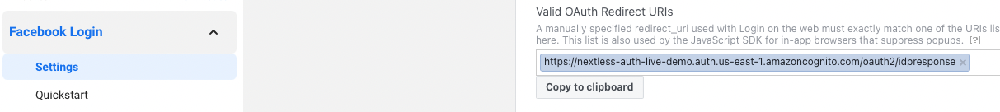

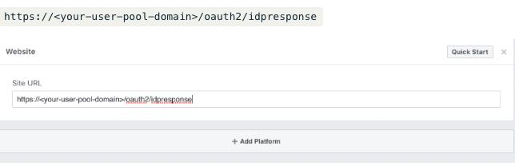

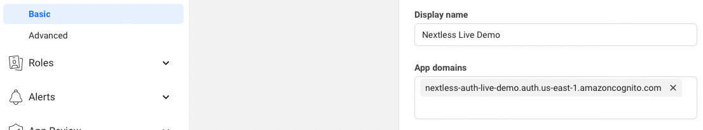

- For Google, you need to fill `Authorized domains`, `Redirect URIs` and `URIs`

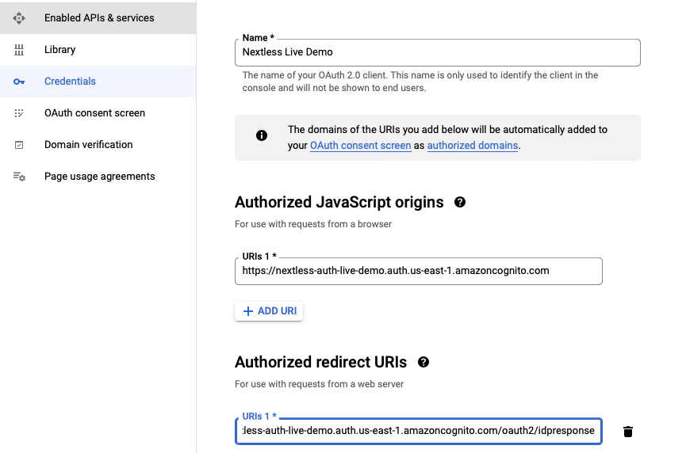

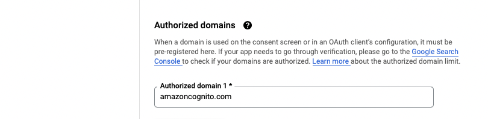

- For Amazon, you need to fill `Allowed Origins` and `Allowed Return URLs`
- For Apple, you need to fill `Domains and Subdomains` and `Return URLs`

#### Configure AWS

Before deploying to production, you need to generate `AWS_ACCESS_KEY_ID` and `AWS_SECRET_ACCESS_KEY` from your AWS account by following this step:

- Login to your AWS account and go to the Identity & Access Management (IAM) page.
- Click on Users and then Add user. Enter a name in the first field to remind you this User is related to the Serverless Framework, like serverless-admin (you can customize the name). Enable Programmatic access by clicking the checkbox. Click Next to go through to the Permissions page. Click on Attach existing policies directly. Search for and select AdministratorAccess then click Next: Review. Check to make sure everything looks good and click Create user.
- View and copy the API Key & Secret to a temporary place. You'll need it in the next step.

Quoted from https://www.serverless.com/framework/docs/providers/aws/guide/credentials/#creating-aws-access-keys. Or, you can check the following link to see how to generate your AWS credentials with screenshots: https://serverless-stack.com/chapters/create-an-iam-user.html

After generating your **API key** and **Secret**, you need to set up in your local machine with aws-cli:

- Install `aws-cli` command line by following this article https://docs.aws.amazon.com/cli/latest/userguide/cli-chap-install.html or on Mac, you can use the following command:

```shell
brew install awscli
```

- Then, run the following command:

```shell
$ aws configure
AWS Access Key ID [None]: AKIAIOSXXXXXXXEXAMPLE
AWS Secret Access Key [None]: wJalrXUtnFEMI/K7MDENG/bPxRfiCYXXXXXXXXXEXAMPLEKEY
Default region name [None]: us-east-1
Default output format [None]: ENTER
```

Quoted from https://www.serverless.com/framework/docs/providers/aws/guide/credentials/#setup-with-the-aws-cli). You don't need to set up a `profile` if you have only one account or one AWS IAM user. Alternatively, you can check another article on to how configure your AWS CLI: https://serverless-stack.com/chapters/configure-the-aws-cli.html

### Deploy the Infrastructure

You can deploy to production the infrastructure with the following command:

```shell
npm install # only if you run it for the first time
npm run deploy-prod
```

For your information, `npm run deploy-prod` is also used to update the infrastructure after making changes.

At end of your deployment, it will print out useful information needed by `ModernMERN-frontend` for configuring authentication in the frontend. Please save the following information:

```shell
Stack prod-modernmern-infra-cognito
  Status: deployed
  Outputs:
    ...
    IdentityPoolId: XXXXXXXX_SAVE_IDENTITY_POOL_ID_XXXXXXXX
    UserPoolClientId: XXXXXXXX_SAVE_USER_POOL_CLIENT_ID_XXXXXXXX
    UserPoolId: XXXXXXXX_SAVE_USER_POOL_ID_XXXXXXXX
    ...
```

> :warning: If the deployment fails and returns `Domain already associated with another user pool.`. You need to update and use different domain `USER_POOL_DOMAIN` in `https://github.com/Nextlessjs/modernmern-infra/blob/main/.env.production#L10`.

After successfully deploying the infrastructure, AWS will also send you an email to `SENDER_EMAIL_ADDRESS` (the environment variable). Please check your inbox and click the link to verify it. So, you can use the validated email address as the sender in SES.

### Create MongoDB database

In this guide, you'll create a MongoDB database on MongoDB Atlas. For your information, you can also use any MongoDB provider.

First, you need to create a MongoDB Atlas account by following this link: https://www.mongodb.com/. After creating your account and successfully signed in, you'll need to create a new project. Then, you should be able to see the following screen:

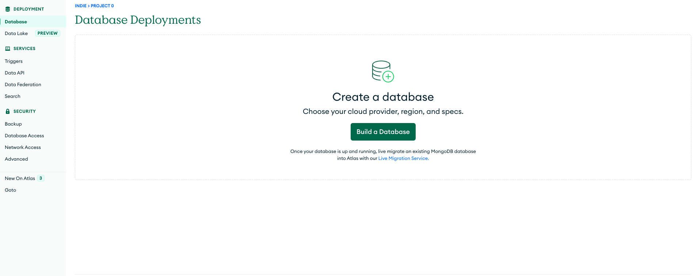

You can click on the `Build a Database` button. In the next screen, you can select the cloud provider and region. Additionally, you can also choose the database name:

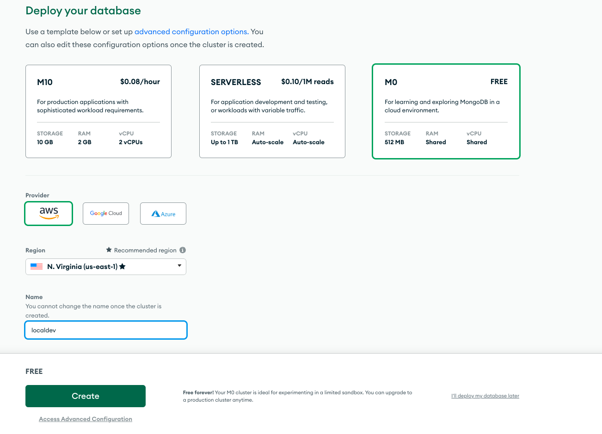

After clicking on the `Create` button, you'll be redirected to the following screen:

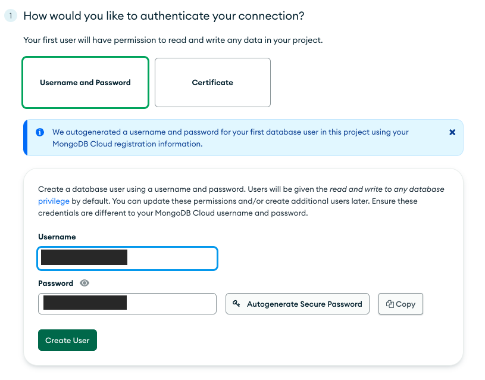

You'll need to create a new database user by adding a username and password.

> :warning: Please save the username and password. You'll need it later.

Then, you can click on the `Create User` button. After that, you need to whitelist `0.0.0.0/0` (Lambda don't have a static IP address) in the `Where would you like to connect from?` section:

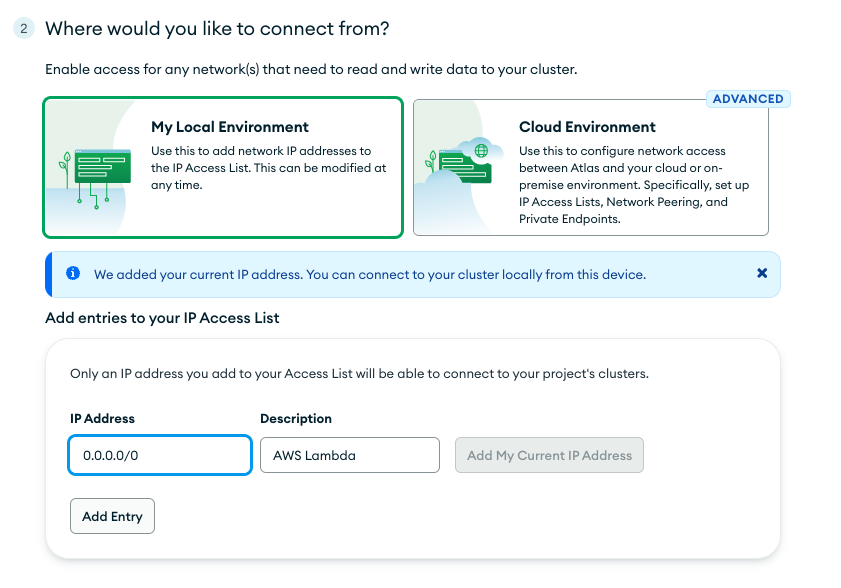

After adding `0.0.0.0/0` to the IP access list, you can click on `Finish and Close`.

Then, you'll need to retrieve the connection string by clicking on the `Connect` button:

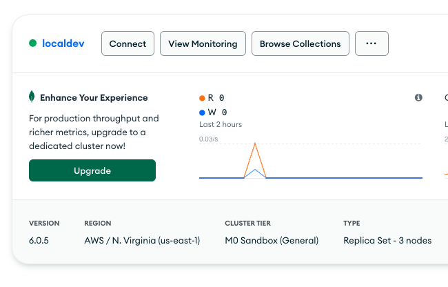

A new popup will appear and you can select the `Driver` button:

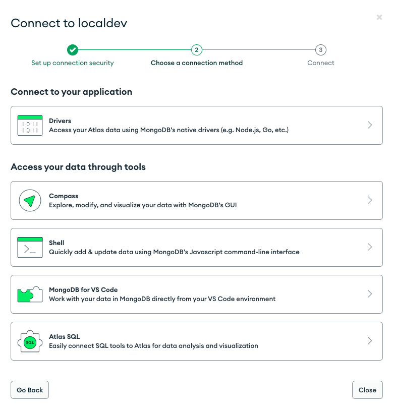

Finally, you can copy the connection string and save it for the next section:

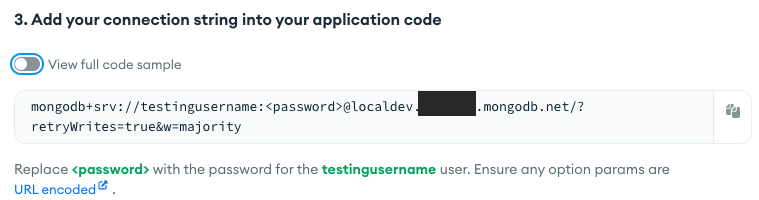

The MongoDB connection string is needed by the backend to connect to the database.

### Deploy the backend

Before deploying your backend to production, please update `FIXME:` comment for production environment. First, you need to create another environment variable file named `.env.production.local` for Stripe key. You need to do the same thing like in the [Stripe guide](STRIPE_LOCAL_INTEGRATION.md) but for production environment:

```shell
STRIPE_SECRET_KEY=XXXXXXXXXYOUR_STRIPE_SECRETXXXXXXXXX
STRIPE_WEBHOOK_SECRET=XXXXXXX_STRIPE_WEBHOOK_SECRETXXXXXXX
```

In `.env.production.local`, you also need to add the MongoDB connection string:

```shell
# Example: mongodb://<username>:<password>@<host>:<port>/<database_name>

DATABASE_URL="mongodb+srv://<mongodb_username>:<mongodb_passsword>@XXX.XXXXXX.mongodb.net/modernmern?retryWrites=true&w=majority"
```

Please replace `<mongodb_username>` and `<mongodb_passsword>` by the username and password you created in the previous step. And, at the end of the connection string, you also need to append `modernmern?retryWrites=true&w=majority`.

Then, in your `.env.production` file, you need also to update `FRONTEND_DOMAIN_URL` entry by adding your frontend domain, domain where your frontend will be hosted.

Due to Serverless 3, you also need to update the `FIXME:` in `serverless.yml`:

```yml
...
  frontendDomain:
    ...
    staging: "https://example.com"
    prod: "https://example.com"
...
```

You need to replace `https://example.com` by the same value as `FRONTEND_DOMAIN_URL` in `.env.production` file.

You also need to update the `FIXME:` comment in `src/utils/BillingPlan.ts` by adding the Stripe product ID.

Then, you can deploy the backend to production with the following command:

```shell
npm run deploy-prod
```

For your information, `npm run deploy-prod` is also used to update the backend after making changes: whether it's a code or configuration change.

At end of your backend deployment, it prints out the webhook endpoint:

```shell
endpoints:
  POST - https://XXXXXXXXXXX.execute-api.us-east-1.amazonaws.com/billing/webhook
```

You need this information to update/create your Stripe webhook for production environment, exactly the same process in [Stripe guide](STRIPE_LOCAL_INTEGRATION.md).

### Deploy the frontend

Like for backend and infrastructure, before deploying your frontend to production, please update `FIXME:` comment for production environment. You need to update `.env.production` by changing the following variable:

- `NEXT_PUBLIC_AWS_API_GATEWAY_URL`, it's the backend endpoint. You get the value at the end of the ModernMERN backend deployment. Here is the following format: `https://XXXXXXXXXXXXXX.execute-api.us-east-1.amazonaws.com`
- `NEXT_PUBLIC_AWS_AUTH_IDENTITY_POOL_ID`, it's the `IdentityPoolId` from ModernMERN Infra displayed at the end of deployment.
- `NEXT_PUBLIC_AWS_AUTH_USER_POOL_ID`, it's the `UserPoolId` from ModernMERN Infra displayed at the end of deployment.
- `NEXT_PUBLIC_AWS_AUTH_APP_CLIENT_ID`, it's the `UserPoolClientId` from ModernMERN Infra displayed at the end of deployment.
- `NEXT_PUBLIC_AWS_AUTH_DOMAIN`, the AWS Cognito domain. The value need to matched the environment variable `USER_POOL_DOMAIN` declared in ModernMERN Infra. Here is the format: `XXXXXXXXXXXXXXXX.auth.us-east-1.amazoncognito.com`
- `NEXT_PUBLIC_AWS_AUTH_REDIRECT_SIGN_IN`, replace `example.com` by the domain where the frontend is hosted
- `NEXT_PUBLIC_AWS_AUTH_REDIRECT_SIGN_OUT`, replace `example.com` by the domain where the frontend is hosted

The last environment variable in `.env.production` you need to change is the Stripe publishable key `NEXT_PUBLIC_STRIPE_PUBLISHABLE_KEY`. You get the value from your Stripe Dashboard.

Then, you also need to update the file `src/utils/SubscriptionPrice.ts` by adding your Stripe priceId for production environment. And, you also need to update the application configuration file located at `src/utils/AppConfig.ts`.

After that, you can create an optimized production build with:

```shell
npm run build-prod
```

Now, your frontend is ready to be deployed. All generated files are located at `out` folder and you can deploy these files to any hosting services. You should be able to deploy on Vercel, Netlify or Amplify Hosting without any issue. If you choose to host on AWS, you can read the next section on how to deploy on Amplify Hosting. With all modern static hosting, you can setup an automated preview of every commit.

#### Deploy the frontend to production with Amplify Hosting

You can host the frontend on Vercel, Netlify or Cloudflare Pages without any issue. But, if you want to have everything inside your AWS account, you can host easily on Amplify Hosting. Amplify Hosting has all major features needed for a modern frontend hosting service like automatically deployment for each pull request and branch, CI/CD included, etc. Here is the steps on how to set up with the ModernMERN built-in configuration for Amplify Hosting.

Go your to AWS Console, then select `AWS Amplify` service. At the bottom of the page, you can select `Amplify Hosting` by clicking on `Get started` button. You just need to follow the setup process by selecting your Git repository. The project has already included a `amplify.yml`. So you don't need to configure anything.

At the end of the process, your frontend is now deployed on your AWS account.

In `Amplify Hosting`, you can set up a custom domain with a free SSL certificate if you want to use your own domain. In Amplify Console, you can easily add a domain to serve your frontend.

> :warning: By default, AWS Cognito send email verification using `no-reply@verificationemail.com`. If you need a custom email instead the default one and a higher daily email limit, please [refer to this documentation](https://docs.aws.amazon.com/cognito/latest/developerguide/user-pool-email.html).

## Deployment errors

If you get an error in the deployment, you can can contact me by email: contact@creativedesignsguru.com. Or, you can also debug the error by checking the console in your browser, logs in your terminal or you can also check the CloudWatch logs in your AWS account.

The Cloudwatch logs are produced by the backend (API gateway and Lambda). In your AWS Console, go to `CloudWatch` service, then select `Logs` and then `Log groups`. The log groups starting with `/aws/lambda/modernmern-` are the logs produced by the lambda. And, the log groups starting with `/aws/http-api/modernmern-` are the logs generated by the API gateway.
