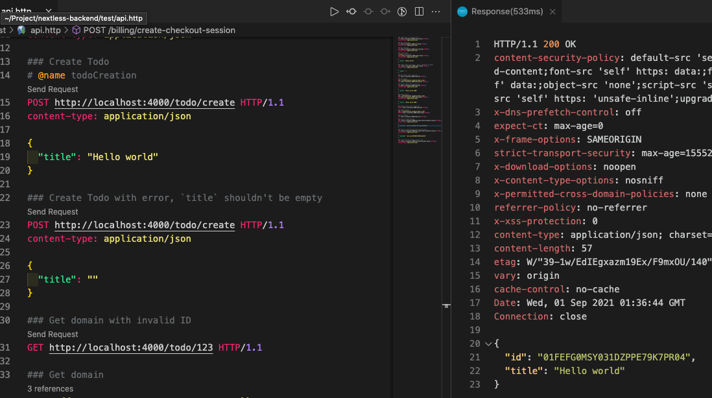
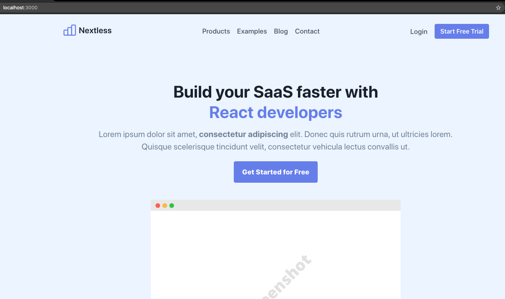
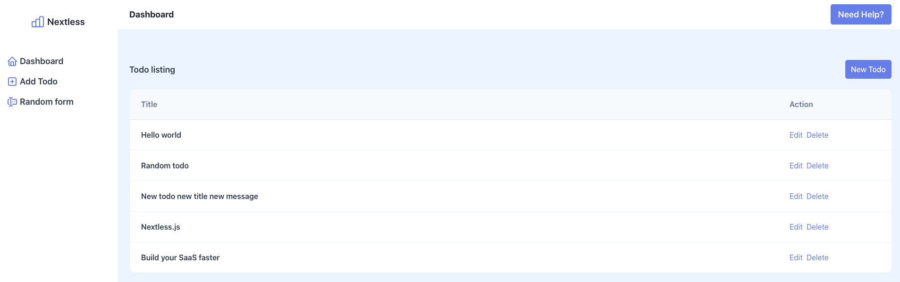

# ModernMERN Quick-Start - Build your SaaS product faster

Thank you for your support. ModernMERN is composed of 3 Git repositories:

- ModernMERN frontend: the landing page and the user dashboard code.
- ModernMERN backend: the REST API code.
- ModernMERN infra: cloud ressources. Long-live/long-term/slowly-changing infrastructure. (Not need for local environment)

If you need any help you can contact us at: contact@creativedesignsguru.com

## Running ModernMERN locally: Backend, Frontend and Stripe Integration

### Requirements

- Node.js 18+ (Node.js 20 recommended) and npm

### Don't fork the project

Unless, you want me to have access ;), please don't fork the repositories.

### Clone the repositories

You need to clone the 3 repositories (Infra, Backend and Frontend):

```shell
git clone git@github.com:Nextlessjs/modernmern-infra.git # Infra
git clone git@github.com:Nextlessjs/modernmern-frontend.git # Frontend
git clone git@github.com:Nextlessjs/modernmern-backend.git # Backend
```

> :warning: If you use the `Download ZIP` button, you won't be able to update the repositories with `git pull` command and it might also cause some issues. So, it's highly recommended to use the `git clone` command to clone the repositories.

Or, you can use the HTTP version:

```shell
git clone https://github.com/Nextlessjs/modernmern-infra.git # Infra
git clone https://github.com/Nextlessjs/modernmern-frontend.git # Frontend
git clone https://github.com/Nextlessjs/modernmern-backend.git # Backend
```

After cloning these 3 projects on your local machine, you need to create 3 new repositories on your GitHub account. Then, you need to update the `origin` remote endpoint of each project to point to the newly created repositories:

```shell
cd my-project-name-infra # or cd my-project-name-backend or cd my-project-name-frontend
git remote set-url origin git@github.com:ixartz/XXXXXXXXX
git push -u origin main
```

`XXXXXXXXX` is the name of your new repository. And, you need to do it for each project.

At this stage, you should have a copy of the ModernMERN on your local machine and on your GitHub account.

Finally, we need to make sure that everything is working properly on your local machine. For your first install, don't make any changes in the repositories, it's easier to debug.

### Running the Backend code

Run the following command on your local environment after cloning the backend project:

```shell
cd my-project-name-backend
npm install
code . # Open VSCode with command line or open it manually. Please make sure that the file `package.json` is at the root of the project in VSCode. `package.json` should NOT be in a subfolder.
```

For the first install, please use only NPM (not yarn) because all repositories have a `package-lock.json`. Also, for the first install, don't update the dependencies right away. You can update the dependencies when everything is working on your local computer.

Then, you can run locally in development mode with live reload:

```shell
npm run dev
```

Open http://localhost:4000 with your favorite browser to see your project. You should get a `{"errors":"not_found"}`. It's genius error because the index isn't defined and it's normal.

If you want to test the backend without the front, you can use `Postman` but what I suggest instead is to use `humao.rest-client` VSCode extension. It helps to run HTTP request in your VSCode.

Located at `test/api.http`, it's a file where you can run requests directly in `humao.rest-client`. All supported requests are provided. So, you can test all the request directly in your VSCode.

**You should be able to do basic create, read, update and delete operator through the REST API. Here is an example to create a Todo:**



Before moving to the next step, you should make sure that the backend and the database is working properly. Inside the `test/api.http` file, please send the first request (GET /user/profile) and you should get the following response:

```json
{
  "id": "8c27d077-fd80-4cda-9b49-b4745d10037d",
  "firstSignIn": "2022-08-25T19:03:47.367Z",
  "teamList": [
    {
      "id": "01GBB675XEV1K2CPY81W9X1EFM",
      "displayName": "New Team"
    }
  ]
}
```

### Running the Frontend code

#### Landing page

Run the following command on your local environment after cloning the frontend project:

```shell
cd my-project-name-frontend
npm install
code . # Open VSCode with command line or open it manually. Please make sure that the file `package.json` is at the root of the project in VSCode. `package.json` should NOT be in a subfolder.
```

For the first install, please use only NPM (not yarn) because all repositories have a `package-lock.json`. Also, for the first install, don't update the dependencies right away. You can update the dependencies when everything is working on your local computer.

Then, you can run locally in development mode with live reload:

```shell
npm run dev
```

Open http://localhost:3000 with your favorite browser to see the project landing page. Here is the result:



#### User dashboard

On your local environment, you can launch the user dashboard by browsing directly to http://localhost:3000/dashboard. Here is an example of the user Dashboard:



> :warning: If you see a white screen at the user dashboard, please make sure the backend is running with `npm run dev`. Most of the time, when you see a white screen, the frontend can't connect to the backend.

The AWS Cognito is bypassed in local environment. So, the login (http://localhost:3000/login) is not required and not working on local. If you absolutely need it, you can set up AWS Cognito for local environment but by default, this is not the case. Setting up Cognito on a local environment comes with some drawbacks like needing an internet connection when working in local. It totally depends on your use cases: you can set up Cognito on local or keep the bypass solution.

> :warning: Because the authentication is simulated in local environment, you won't be able to change the email or the password. If you want a real authentication on local environment, you need to deploy `ModernMERN-infra` and `ModernMERN-backend` on your AWS account. Then, your local `ModernMERN-frontend` can connect this deployed environment.

### Start customizing your project

You have access to all features in user dashboard. You can make all necessary changes without any limitation. So, you are now ready to makes changes in ModernMERN and adapt to your own needs.

But, if you need some details, you can check out this guide on [how to customize](START_CUSTOMIZATION.md).

### Testing Stripe locally

> :warning: At the current state, Stripe feature isn't working because we haven't setup any environment variables. So, if you want upgrade your plan or manage your subscription, you won't able to do it without configuring Stripe.

You can stop here if you don't want to test Stripe right now. Setting up Stripe is a long process, you might not need Stripe right now at the beginning.

Here is the guide to have [Stripe working locally with webhook](STRIPE_LOCAL_INTEGRATION.md).

### Deploy in production

Same for production deployment, you can deploy later and you might not need at the beginning. After going through this tutorial, you can start customizing to your needs and use cases in your local environment.

If you need to deploy in production, you can [follow this guide](PRODUCTION_DEPLOYMENT.md).

### Learn more about the architecture

In this section, I'll share the overall architecture of ModernMERN. It'll help you to understand how it works:

- [Architecture overview](ARCHITECTURE_OVERVIEW.md)
- [Authentication with AWS Cognito](AUTHENTICATION_ARCHITECTURE.md)
- [Routing](ROUTING.md)
- [Testing strategy](TESTING_STRATEGY.md)

### Update to the latest version

If you want to update ModernMERN to the latest version, you can follow this guide: [Update ModernMERN to the latest version](UPDATE_MODERNMERN.md).

### Advanced tips

You can find some random and advanced tips on [this page](ADVANCED_TIPS.md).

### Common error messages

A list of the most common error messages is available on [this page](COMMON_ERRORS.md). So, if you have an error message, you can check if it's listed here and find a solution.
