# ModernMERN Quick-Start - Stripe integration

### Testing Stripe locally

#### Customer portal

First, go to your settings by clicking to this icon. Then, click to `Customer portal` link:

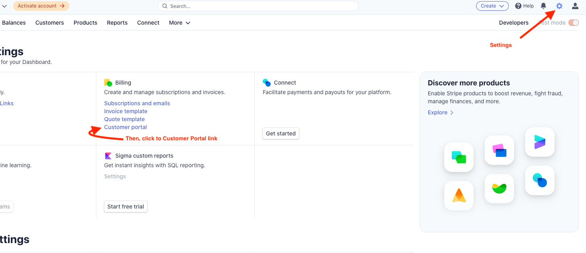

Here is ModernMERN default configuration for the Stripe customer portal:

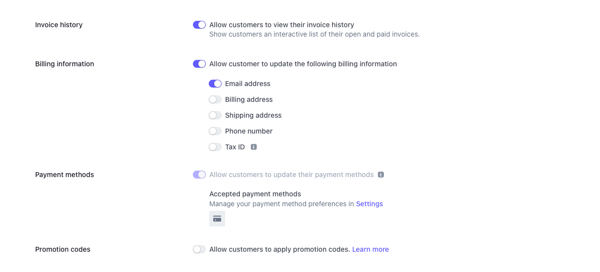

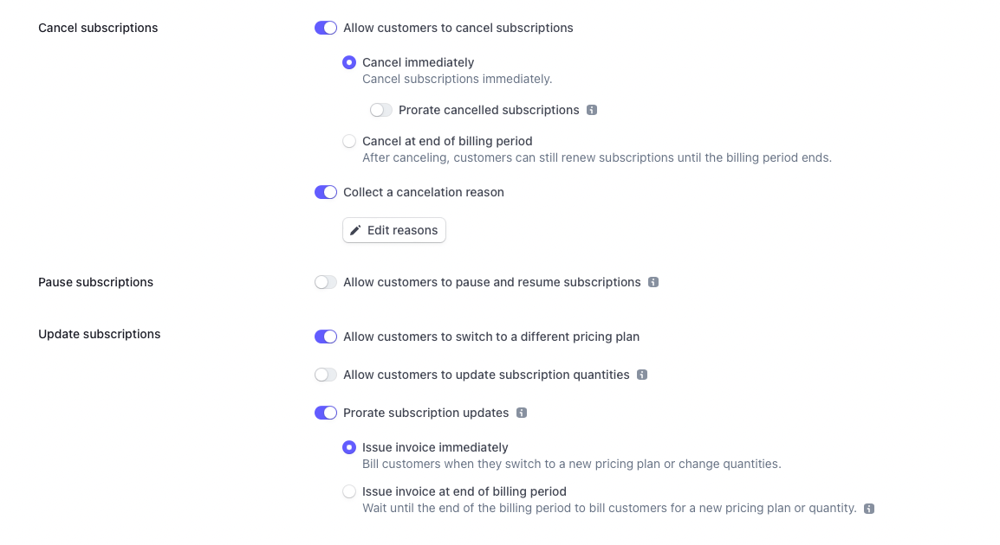

If you are setting up the Stripe customer portal for the first time, you should use exactly the same configuration as above. Later, you can personalize based on your needs.

> :warning: It's important to save Customer Portal settings. Otherwise, the backend will not be able to create a customer portal session and you'll get an error: "You can't create a portal session in test mode until you save your customer portal settings in test mode at https://dashboard.stripe.com/test/settings/billing/portal."

#### Add product into Stripe account

Go to your Stripe account and add a new product like this:

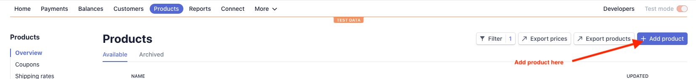

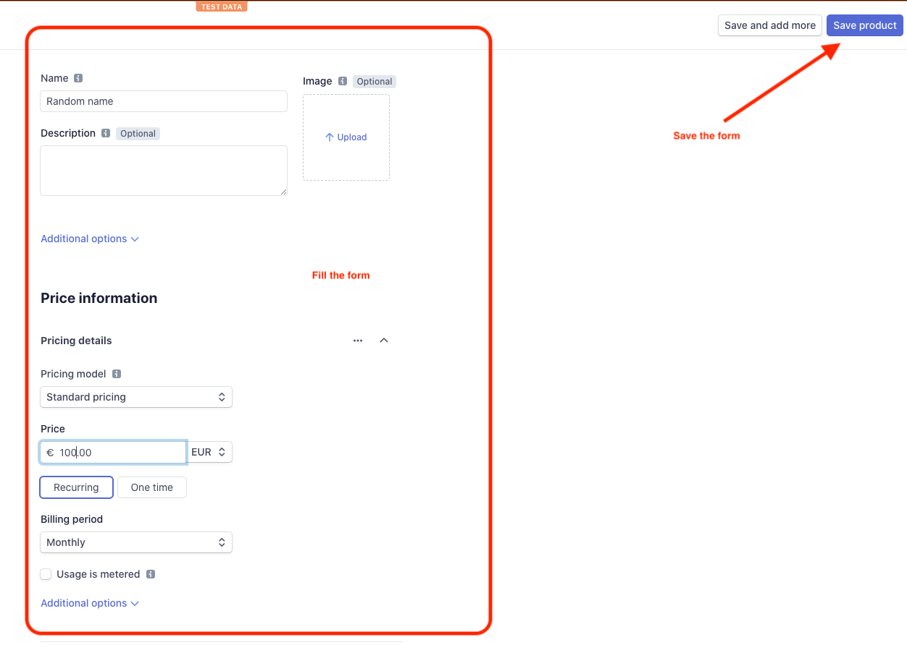

#### Update your Frontend and Backend code

After generating your product, you need to update manually your Frontend and Backend code:

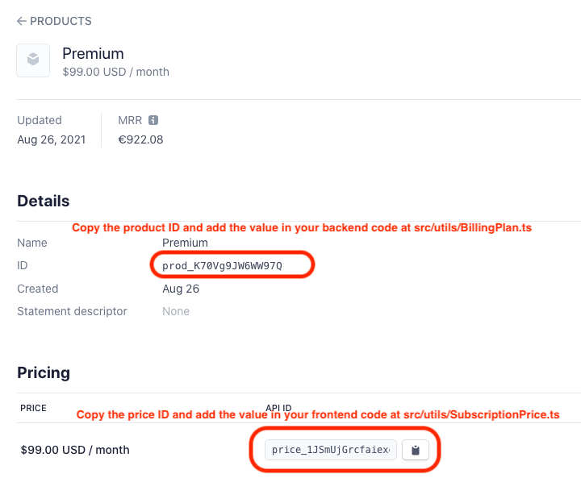

The code contains `FIXME:` should guide you on how to modify, you just need to add or replace price and product id:

- In `ModernMERN-backend`, you also need to update the `FIXME:` comment in `src/utils/BillingPlan.ts` by adding the Stripe product ID.
- In `ModernMERN-frontend`, you also need to update the `FIXME:` comment in `src/utils/SubscriptionPrice.ts` by adding the Stripe price ID.

#### Stripe Webhooks in local environment

Go to Stripe Webhooks pages:

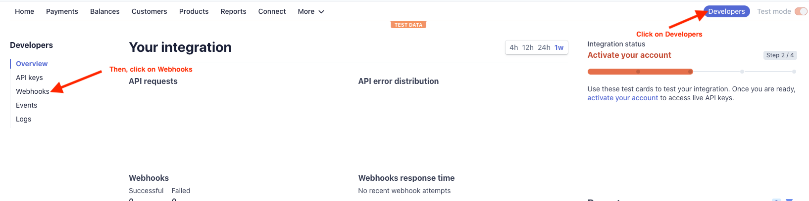

Then, you'll see this page:

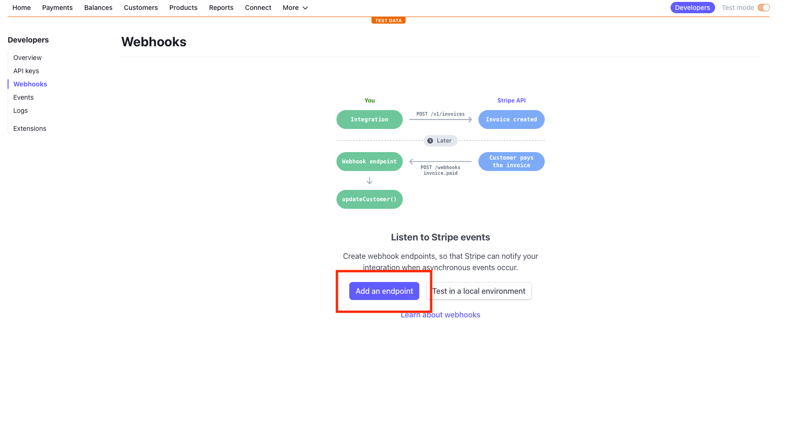

Then, click on 'add an endpoint' and fill the form by providing the following information:

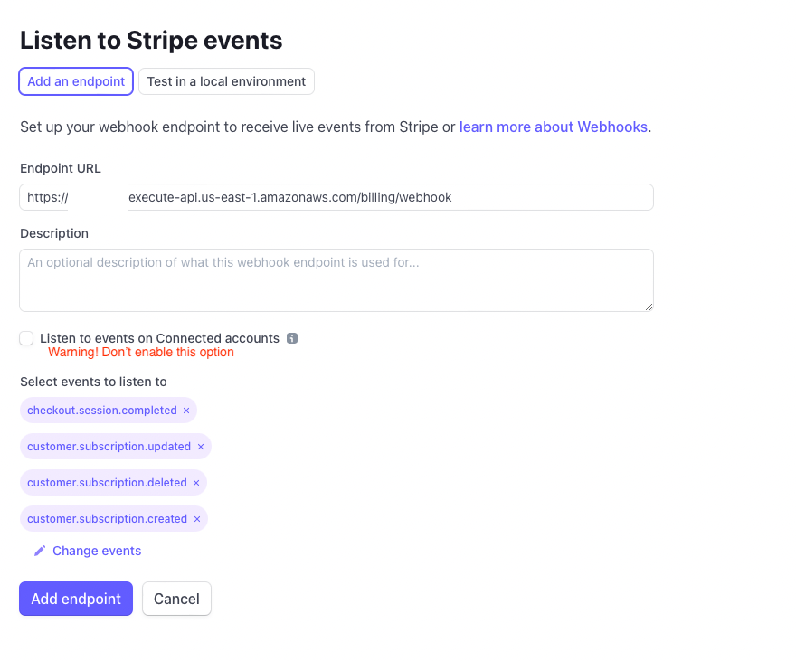

In `Endpoint URL`, you need to provide the webhook endpoint like `https://example.com/billing/webhook`. For local testing, you don't need an existing domain. So, you can keep using `example.com` until you go to production. Stripe CLI have the ability to temporary override this value for local testing purpose.

> :warning: In our use cases, please DON'T enable 'Listen to events on connected accounts' option. Otherwise, your webhook won't be triggered.

In `Select events to list to`, add the following events:

- customer.subscription.updated
- customer.subscription.deleted
- customer.subscription.created
- checkout.session.completed

After creating your endpoint, you need to retrieve your Stripe webhook signing secret:

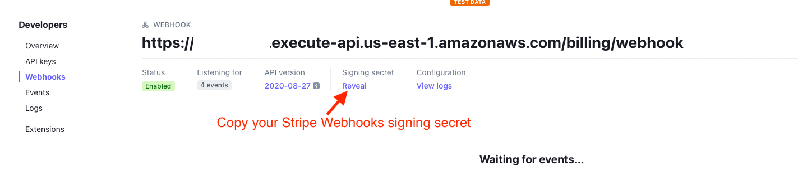

Copy your signing secret and paste in your `ModernMERN-backend` environment file named `.env.development.local` (if the file doesn't exist, you need to create it and the file won't be tracked by git) with a new entry named `STRIPE_WEBHOOK_SECRET`.

> For security reasons, please don't commit secret key on your Git repository. By default, all environment files ending with `.local` won't be tracked by Git. Environment variable ending with `.local` are perfect to store secret key. In the opposite, without `.local`, files are tracked by Git and you can store nonsensitive data.

You also need to copy your Stripe Secret key:

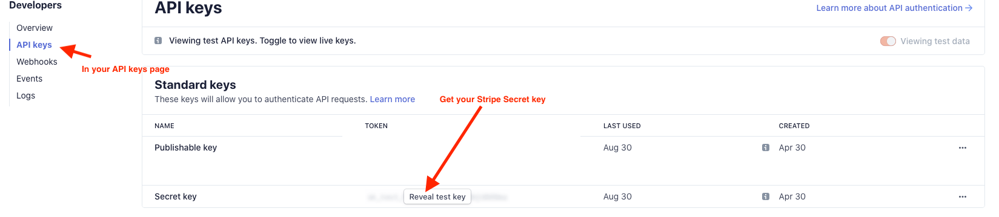

Paste your secret key in your `ModernMERN-backend` environment file named `.env.development.local` with another entry named `STRIPE_SECRET_KEY`. Now, in your `.env.development.local`, you should have the following information:

```shell
STRIPE_SECRET_KEY=sk_test_XXXXXXXXXX
STRIPE_WEBHOOK_SECRET=XXXXXXXXXXXXXX
```

In your `ModernMERN-frontend` environment file named `.env.development.local` (if the file doesn't exist, you need to create it and the file won't be tracked by git), you need to add a new entry named `NEXT_PUBLIC_STRIPE_PUBLISHABLE_KEY` and you get this value from:

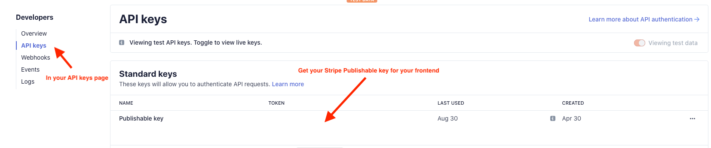

Now, your `.env.development.local` in `ModernMERN-frontend` should look like this:

```shell
NEXT_PUBLIC_STRIPE_PUBLISHABLE_KEY=pk_test_XXXXXX
```

After this long manual process, you can now install stripe-cli: https://stripe.com/docs/stripe-cli#install

Then, you'll able to log in with your Stripe account:

```shell
stripe login
```

Finally, you can now launch the following command:

```shell
stripe listen --load-from-webhooks-api --forward-to localhost:4000
```

After running the command, it'll display a new webhook signing secret. So, you need update the variable `STRIPE_WEBHOOK_SECRET` located at `.env.development.local` in `ModernMERN-backend`.

Stripe can invoke your webhook in your local computer and you'll able to make the necessary changes without deploying to production.

You have now everything working locally backend, frontend and Stripe integration. In development mode, you can test your Stripe integration by using `4242 4242 4242 4242` as your card number, a random three-digit CVC number, and any expiration date in the future.

You are now ready to makes changes in ModernMERN and adapt to your own needs with Stripe. Here is some material to help you to [customize your Stripe integration](CUSTOMIZE_STRIPE.md).
